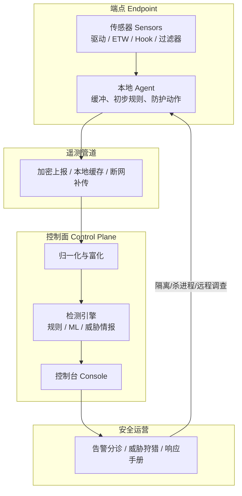
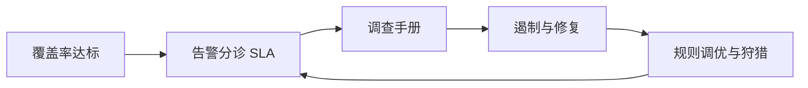

如果你听到「EDR」就觉得像黑盒：装了一个 Agent，然后安全团队就知道电脑上发生了什么——这篇文章会把它拆开讲清楚：**它是什么、为什么会出现、内部怎么采数据、怎么判定恶意、怎么响应**，以及和杀毒、XDR 有何不同。

![[edr-architecture-explained.png]]

> **重要声明**  
> 1. 本文只讲 **EDR 的原理、架构与防御落地**，**不提供任何绕过、对抗、免杀的可操作步骤或代码**。  
> 2. 「怎么绕过 EDR」属于攻击技术教程范畴，本文明确不写。若你做红蓝对抗，请在**书面授权**的靶场内使用厂商/教练提供的合法演练方案。  
> 3. 关键定义与能力描述尽量引用厂商术语页、分析师定义与公开技术文章，便于核对。

---

## 一、一句话先记住

**EDR = 在电脑/服务器（端点）上持续记录「系统级行为」，把这些行为汇到中心去分析，发现可疑后能告警、隔离、调查、修复。**

Gartner 分析师 Anton Chuvakin 提出的经典表述是：EDR 会**记录并存储端点系统级行为**，用多种数据分析技术**检测可疑行为**，提供**上下文**，**阻止恶意活动**，并给出**修复建议**以恢复受影响系统。  
可核对：

- [CrowdStrike：What is EDR？（引用该定义）](https://www.crowdstrike.com/en-us/cybersecurity-101/endpoint-security/endpoint-detection-and-response-edr/)  
- [Fortinet 术语页：什么是 EDR](https://www.fortinet.com/cn/resources/cyberglossary/what-is-edr)  
- [ClearNetwork EDR 综述（同样引用 Chuvakin 定义）](https://clearnetwork.com/endpoint-detection-and-response-edr/)

---

## 二、为什么需要 EDR？（小白故事版）

### 2.1 传统杀毒更像「门卫认脸」

经典杀毒（AV）强项是：文件落盘时对照**已知特征**（哈希、特征码、签名）。  
它很擅长挡「已经见过的坏人」，但对下面几类往往吃力：

- **无文件 / 少文件**：恶意逻辑主要活在内存、脚本、合法工具滥用里  
- **活体攻击**：人操作的勒索、横向移动，步骤拆开看每一步都「有点像运维」  
- **零日与变种**：特征库还没跟上

### 2.2 EDR 更像「装了行车记录仪 + 事故处理中心」

EDR 不只问「这个文件是不是病毒」，更问：

> 谁拉起了谁？改了哪些文件/注册表？读了谁的内存？连了哪个外网？这一串行为合在一起像不像攻击？

所以它天然适合：持续监控、调查取证、隔离主机、指导修复。Fortinet 把工作流概括为：**持续监控 → 汇聚遥测 → 关联异常 → 告警与自动处置 → 保留取证数据**。  
来源：[Fortinet · EDR 如何工作](https://www.fortinet.com/cn/resources/cyberglossary/what-is-edr)

---

## 三、先分清四个容易混的词

| 名词 | 白话 | 和 EDR 的关系 |
|------|------|----------------|
| **AV（杀毒）** | 以特征/启发式为主的恶意软件拦截 | 常作为 EDR/EPP 里的一层能力 |
| **EPP（端点防护平台）** | 强调**预防**：拦恶意软件、缩减攻击面 | Gartner 将 EDR 能力视为现代 EPP 的重要组成部分 |
| **EDR** | 强调**检测 + 响应 + 调查** | 本文主角 |
| **XDR** | 把端点、网络、身份、云等多源遥测放在一起做检测响应 | EDR 向「跨域」演进的方向 |

Gartner 对 EPP 的公开能力描述里，明确写到 EDR 功能关注：**记录系统级行为 → 检测可疑 → 调查/阻断 → 修复**；并指出 EPP 正与更多数据源整合，向 XDR 演进。  
来源：[Gartner Critical Capabilities for EPP（公开 PDF 转载）](https://www.content.shi.com/cms-content/accelerator/media/pdfs/sentinelone/sentinelone-051123-2022-gartner-critical-capabilities-for-endpoint-protection-platforms.pdf)

一句话对照：

```text
EPP 偏「尽量别让坏事发生」
EDR 偏「坏事发生了也能看见、拦住、查清、修好」
XDR 偏「不只看这一台电脑，而是看整条攻击链路上的多个传感器」
```

---

## 四、EDR 总体架构（实现全景）

把任意主流 EDR 抽象成五层，你就能看懂绝大多数产品说明书：



### 4.1 传感器（Sensors）：眼睛和耳朵

负责在操作系统里**看见**事件：进程创建、文件改写、注册表、网络连接、跨进程访问、脚本内容等。

### 4.2 Agent：本地管家

- 控制传感器启停与策略  
- 做一部分**近端分析**（不等云端也能拦急症）  
- 把遥测打包上报；断网时本地缓存  
- 执行响应：断网隔离、结束进程、隔离文件、采集取证包等  

公开原理介绍常把 EDR 拆成 **Agent、遥测、传感器** 三块。  
参考：[杀毒软件与 EDR 原理（公开讲义）](https://raven-medicine.com/books/ec8ce/page/edr/export/pdf)

### 4.3 遥测（Telemetry）：原料数据

遥测 = 传感器吐出来的**原始/半结构化事件流**。  
不同厂商覆盖面不同；社区有人整理各 EDR 采集项对比，例如开源仓库 [tsale/EDR-Telemetry](https://github.com/tsale/EDR-Telemetry)（第三方整理，仅作对照，非官方标准）。

### 4.4 后端检测与控制台：大脑与仪表盘

- **归一化**：把 Windows/macOS/Linux 事件翻成统一字段  
- **富化**：补进程树、用户、签名、威胁情报命中、地理位置等  
- **检测**：规则、行为链、机器学习、威胁情报碰撞  
- **控制台**：给 SOC 看告警、时间线、远程响应  

安全内参对一类「把主流 EDR 检测逻辑本地化」的工程复现，描述了典型流水线：  
**内核驱动 + ETW 采集 → 统一事件 → 富化关联 → 厂商检测模块 → SOC 风格告警**。  
来源：[安全内参：把四款主流 EDR 的检测逻辑拆出来本地运行](https://www.secrss.com/articles/91724)

### 4.5 响应闭环：手脚

常见能力（产品各有差异）：

- 主机网络隔离（遏制横向）  
- 终止进程 / 隔离文件  
- 远程脚本调查（Realtime Response）  
- 回滚/修复（部分产品对勒索场景强调更强）  
- 与 SIEM / SOAR / 工单系统联动  

Fortinet 将核心循环概括为：**检测 → 遏制 → 调查 → 消除/修复**。  
来源：[Fortinet · 关键功能组件](https://www.fortinet.com/cn/resources/cyberglossary/what-is-edr)

---

## 五、实现原理深挖（以 Windows 为例，小白可懂）

> 说明：各厂商实现细节保密且互不相同。下面讲的是业界**公开、反复出现**的技术路径，帮你理解「它凭什么看见」，不是某款产品的源码复现。

### 5.1 总览：用户态 + 内核态双层观测

```text
┌─────────────────────────────────────────────┐
│ 用户态：API Hook / ETW 消费 / AMSI 脚本扫描   │
├─────────────────────────────────────────────┤
│ 内核态：进程/线程回调、对象回调、               │
│         注册表回调、文件系统微过滤驱动、部分 ETW │
└─────────────────────────────────────────────┘
```

公开技术文常把现代 EDR 写成「用户态到内核态的多层监控闭环」。  
（本文只引用其**机制分类**，不展开任何对抗操作。）

### 5.2 内核回调：系统主动「打电话通知」EDR

Windows 允许驱动注册回调：当进程创建/退出、镜像加载、线程创建、注册表改动、打开进程句柄等事件发生时，内核依次通知已注册的例程。

例如进程创建相关 API（微软文档公开）：

- [`PsSetCreateProcessNotifyRoutineEx`](https://learn.microsoft.com/windows-hardware/drivers/ddk/ntddk/nf-ntddk-pssetcreateprocessnotifyroutineex)

安全研究文章用逆向视角说明：用户态创建进程最终会走到内核路径，内核遍历回调数组通知驱动——**无需对每个 API 手工 Hook**，这是稳定、可共存的官方机制。  
来源：[安全客：Windows 内核回调实现原理与逆向调试分析](https://www.anquanke.com/post/id/230073)

**小白类比**：不是偷偷在门锁上装针孔，而是物业在门禁系统里登记了「每次开门都发短信」——开门这件事本身由系统广播。

**EDR 用它通常做什么**

- 记录父子进程关系（进程树）  
- 看到谁启动了 `powershell`、`wscript`、办公宏拉起的子进程等  
- 结合命令行、签名、路径做第一层判断  

### 5.3 文件系统微过滤驱动（Minifilter）：盯文件与部分命名管道

驱动挂在文件系统过滤栈上，可观察创建、写入、删除、重命名等。  
公开工程复现文提到：可用微过滤捕获文件操作，甚至关注重解析点等更偏技巧的行为（用于识别某些滥用手法的**检测侧**描述）。  
来源：[安全内参文 · 驱动四类回调](https://www.secrss.com/articles/91724)

**小白类比**：库房每进一箱货、改一次标签，仓管系统都留单据。

### 5.4 对象回调：谁在碰谁的进程

例如某进程试图打开 `lsass.exe` 并申请读内存权限——这类**跨进程敏感访问**可被对象回调记下来（含权限掩码、调用栈等，具体字段因实现而异）。  
来源：同上安全内参文。

这对凭证窃取、进程注入相关行为的**检测**特别关键（再次强调：本文不讨论如何实施这些攻击）。

### 5.5 ETW（Event Tracing for Windows）：系统自带的「高精度示波器」

ETW 是 Windows 内置的事件追踪设施。EDR 可订阅特定 Provider，拿到驱动回调不一定直接给的细粒度事件，例如威胁情报相关 Provider、脚本/AMSI、DNS、.NET 加载等（产品订阅集合不同）。

公开原理讲义指出：ETW 能提供 Agent「不容易直接拿到」的遥测，例如与 .NET 相关的加载信息等。  
来源：[杀毒与 EDR 原理讲义](https://raven-medicine.com/books/ec8ce/page/edr/export/pdf)

微软总览文档入口：

- [About Event Tracing](https://learn.microsoft.com/windows/win32/etw/about-event-tracing)

**小白类比**：操作系统自己在关键路口装了测速摄像头，EDR 去订阅录像流。

### 5.6 用户态 API Hook：在常用 API 门口加安检

部分 EDR 会在用户态对常见 Windows API / 对应 NT API 做 Inline Hook 或类似跳转，把执行流先引入检测逻辑再返回原函数。  
原理讲义提到：常用 API 对应的 NTAPI 可能被用户态 Hook 观察。  
来源：[同上讲义](https://raven-medicine.com/books/ec8ce/page/edr/export/pdf)

**小白类比**：本来直接进办公室，现在门口多了一位保安问「你来干什么」，问完再放行。

注意：现代产品越来越强调**内核遥测 + 行为关联**，不完全依赖用户态 Hook；具体以厂商架构为准。

### 5.7 AMSI：脚本内容扫描接口

Windows 提供 [AMSI（Antimalware Scan Interface）](https://learn.microsoft.com/windows/win32/amsi/antimalware-scan-interface-portal)，让安全产品在脚本执行前有机会扫描内容。  
公开复现文提到：订阅 AMSI 相关 ETW/接口可支撑对 PowerShell/VBScript/JScript 等内容的检测。  
来源：[安全内参文](https://www.secrss.com/articles/91724)

### 5.8 把「看见」变成「看懂」：富化与行为链

原始事件往往是碎片。检测引擎会做：

1. **进程树拼图**：A 启动 B，B 启动 C  
2. **时间窗关联**：短时间内「办公软件 → 脚本 → 异常网络」连成一条故事  
3. **IOC / IOA**  
   - IOC：已知坏哈希、坏域名（点状证据）  
   - IOA：符合攻击手法的行为模式（故事性证据）  
4. **机器学习 / 云端情报**：对未见过的样本与行为打分  

CrowdStrike 等厂商公开材料强调：EDR 记录端点与工作负载上的活动，让安全团队看见否则不可见的事件。  
来源：[CrowdStrike EDR 101](https://www.crowdstrike.com/en-us/cybersecurity-101/endpoint-security/endpoint-detection-and-response-edr/)

---

## 六、一次「完整生命周期」示例（纯防御叙事）

假设员工打开了一封钓鱼邮件里的文档（**不要在未授权环境复现攻击**）：

```text
1. 传感器：看到 WINWORD.EXE 创建子进程 → powershell.exe，并记下命令行
2. Agent：本地规则认为「办公软件拉起加密混淆脚本」风险高 → 可先拦截或降权
3. 上报：事件进入后端，拼进该用户主机的时间线
4. 检测：关联到异常外连域名（威胁情报命中）→ 生成中高危告警
5. 响应：SOC 一键隔离主机网络；结束可疑进程；拉取取证包
6. 修复：清残留、重置凭证、补丁邮件网关规则；把新 IOA 写回检测库
```

你看到的不是「一个病毒文件」，而是**一整段故事**——这就是 EDR 相对传统扫盘的核心价值。

---

## 七、EDR 常见能力清单（选型/验收可用）

结合 CrowdStrike「选购关注点」与 Fortinet 功能描述，整理成验收表：

| 能力 | 你要问厂商/自己的问题 |
|------|------------------------|
| 端点可见性 | 能否看进程树、文件、注册表、网络、跨进程访问？覆盖 Win/macOS/Linux？ |
| 遥测保留 | 原始事件保留多久？能否回溯狩猎？ |
| 行为防护 | 是否不仅靠特征，还有行为链/ML？ |
| 威胁情报 | 情报源与更新频率？ |
| 响应速度 | 隔离主机、远端调查要几步？是否支持自动化手册？ |
| 抗篡改 | Agent 被普通管理员卸载是否困难？是否有防关闭？ |
| 性能 | CPU/内存开销、兼容性白名单机制？ |
| 集成 | 能否对接 SIEM/SOAR/工单/身份系统？ |
| 云/本地 | 控制面部署形态是否符合合规（数据出境等）？ |

参考：

- [CrowdStrike：EDR 应关注的要点](https://www.crowdstrike.com/en-us/cybersecurity-101/endpoint-security/endpoint-detection-and-response-edr/)  
- [Fortinet：EDR 优势与集成](https://www.fortinet.com/cn/resources/cyberglossary/what-is-edr)

---

## 八、关于「绕过」：本文能说什么、不能说什么

### 8.1 不能提供的内容

**任何**具体的绕过步骤、补丁手法、关闭传感器的操作、PoC、免杀思路落地细节——**本文一律不写**。  
公开网络上存在大量「EDR 对抗」文章，那不代表你可以在未授权系统上使用；在中国及其他司法辖区，未授权绕过安全防护常涉及违法。

### 8.2 防御者只需要理解的「威胁模型」（概念层）

攻击者写攻略时，本质是在想：

> 怎样让「传感器少看见一点」或「看见了但像正常运维」？

对应到防御加固，你应假设对方可能试图：

1. **削弱观测面**：干扰用户态钩子、ETW 消费、脚本扫描等（具体手法本文不列）  
2. **伪装成合法行为**：滥用已签名工具、贴近管理员操作习惯，降低 IOA 命中  
3. **对抗 Agent 本身**：试图停止服务、破坏驱动（现代 EDR 通常有抗篡改）  
4. **钻策略空子**：利用错误的排除名单、过大的白名单、关闭云查  

**你的对策不是去学绕过，而是：**

- 收紧排除项与本地管理员权限  
- 打开云查/行为防护/抗篡改  
- 用攻击面管理减少「合法工具滥用」空间  
- 把 EDR 告警与身份、邮箱、网络日志交叉验证  
- 定期做**授权下的紫队演练**，用结果改进检测规则，而不是传播绕过教程  

---

## 九、和 SOC 一起转起来（落地运营）

光装 Agent 不等于有 EDR 能力。建议最小运营闭环：



1. **覆盖率**：关键资产必须在线、版本一致  
2. **分诊**：按严重度设响应时限，减少告警疲劳  
3. **手册**：勒索、挖矿、可疑 PS、异常 lsass 访问等各写一页流程  
4. **度量**：MTTD / MTTR、隔离成功率、复发率  
5. **演练**：每季度一次桌面推演或授权红蓝  

Fortinet 也强调 EDR 与 SIEM、SOAR、XDR 集成能提升运营效率。  
来源：[Fortinet EDR 页](https://www.fortinet.com/cn/resources/cyberglossary/what-is-edr)

---

## 十、小白 14 天自学路线（合法）

| 天数 | 学什么 | 如何验收 |
|------|--------|----------|
| 1–2 | 读完本文 + Fortinet/CrowdStrike EDR 术语页 | 能口述 EDR vs AV vs XDR |
| 3–5 | 学进程、权限、PE 签名、命令行基础（微软文档） | 能看懂一张进程树截图 |
| 6–8 | 读微软 ETW / AMSI 官方文档标题级内容 | 知道 EDR 为何订阅它们 |
| 9–11 | 读内核回调原理文（安全客）到「回调是通知机制」为止 | 能解释「为何不用处处 Hook」 |
| 12–14 | 若有条件：在实验机安装**正版/试用 EDR**，只做防御侧点击告警、隔离演练 | 写出一页事件响应笔记 |

---

## 十一、参考与延伸阅读

### 定义与产品能力（偏「是什么」）

1. [CrowdStrike：What is EDR?](https://www.crowdstrike.com/en-us/cybersecurity-101/endpoint-security/endpoint-detection-and-response-edr/)  
2. [Fortinet：什么是端点检测和响应](https://www.fortinet.com/cn/resources/cyberglossary/what-is-edr)  
3. [ClearNetwork：EDR Comprehensive Overview](https://clearnetwork.com/endpoint-detection-and-response-edr/)  
4. [Gartner Peer Insights：Endpoint Protection Platforms 市场说明](https://www.gartner.com/reviews/market/endpoint-protection-platforms)  
5. [Gartner Critical Capabilities for EPP（公开 PDF）](https://www.content.shi.com/cms-content/accelerator/media/pdfs/sentinelone/sentinelone-051123-2022-gartner-critical-capabilities-for-endpoint-protection-platforms.pdf)

### 实现机制（偏「怎么看见」）

6. [Microsoft Learn：PsSetCreateProcessNotifyRoutineEx](https://learn.microsoft.com/windows-hardware/drivers/ddk/ntddk/nf-ntddk-pssetcreateprocessnotifyroutineex)  
7. [Microsoft Learn：About Event Tracing (ETW)](https://learn.microsoft.com/windows/win32/etw/about-event-tracing)  
8. [Microsoft Learn：AMSI](https://learn.microsoft.com/windows/win32/amsi/antimalware-scan-interface-portal)  
9. [安全客：Windows 内核回调实现原理](https://www.anquanke.com/post/id/230073)  
10. [杀毒软件与 EDR 原理讲义](https://raven-medicine.com/books/ec8ce/page/edr/export/pdf)  
11. [安全内参：主流 EDR 检测逻辑本地化复现观察](https://www.secrss.com/articles/91724)  
12. [GitHub：EDR-Telemetry 采集项对照（第三方）](https://github.com/tsale/EDR-Telemetry)

### 演进阅读

13. [SDxCentral：EDR 普及与向 XDR/SASE 演进（引用 Gartner 观点）](https://www.sdxcentral.com/news/edr-reaches-wide-adoption-paving-way-for-xdr-sase/)

---

## 十二、结语

- **EDR 的本质**：端点行为的黑匣子 + 分析大脑 + 响应手柄。  
- **实现的关键**：内核回调、文件/注册表/对象监控、ETW、（可选）用户态 Hook 与 AMSI，再加云端关联。  
- **价值不在装上 Agent，而在会看时间线、会遏制、会复盘。**  
- **绕过教程不会出现在本文**；把精力放在覆盖率、抗篡改、减少白名单、交叉验证与授权演练上，才是正确方向。

若你指定具体产品（如微软 Defender for Endpoint、某一国产 EDR），我可以再写一版**仅含官方控制台操作与加固项**的「管理员上手手册」，同样不包含任何绕过内容。
