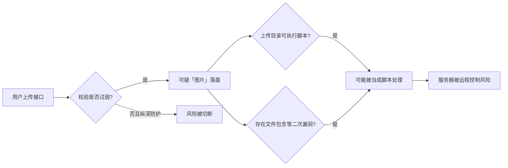
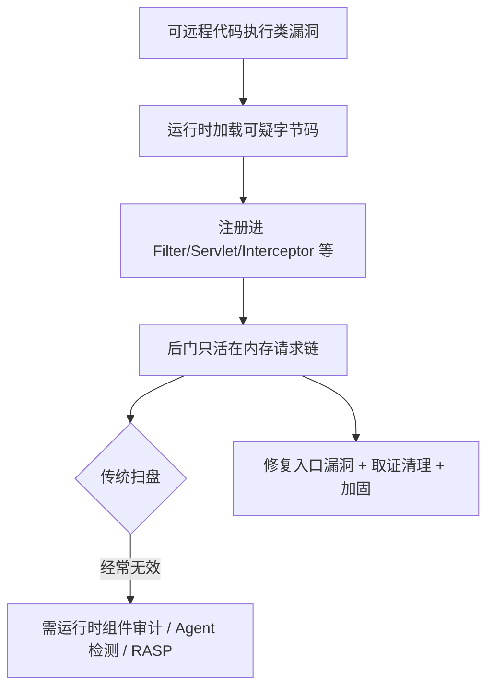
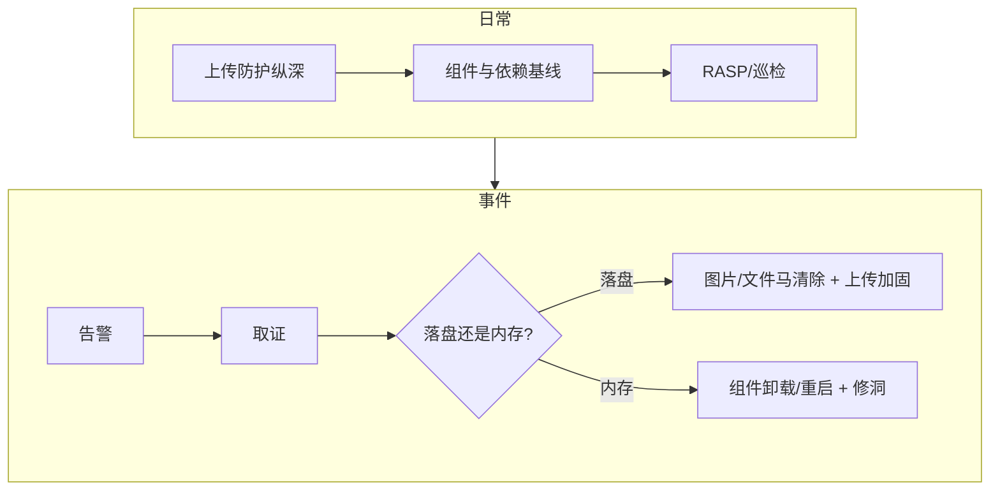

本文面向「完全零基础」读者，用防御者视角讲清两件事：**图片马**和**内存马**分别是什么、为什么难查、以及每一类风险对应哪些可落地的防护与排查方法。

![[webshell-image-memory-defense.png]]

> **重要声明**  
> 1. 本文**只写原理认知与攻击防范/检测/应急**，不提供任何可复现的植入、构造、利用步骤或恶意样本。  
> 2. 「仅用于学习」不能成为未授权攻击的理由。请在自建靶场或明确书面授权环境中做合法实验。  
> 3. 「每个字都带来源」在技术写作中不可行；下文对**关键结论**给出可点击的权威或可考证链接，便于你自行核对。

---

## 一、先建立一张总地图

把两者放在同一条「Web 被入侵后」的链路里理解：

```text
入口漏洞（上传/反序列化/表达式注入/文件包含等）
        │
        ├─► 落盘型后门 ──► 图片马、JSP/PHP 文件马等（磁盘上有东西）
        │
        └─► 无文件/少文件后门 ──► 内存马（主要活在进程内存里）
```

| 对比维度 | 图片马（常见形态） | 内存马（常见形态） |
|----------|--------------------|--------------------|
| 主要载体 | 看起来像图片的上传文件 | JVM / Web 容器内存中的组件 |
| 是否落盘 | 通常有文件 | 往往无独立恶意文件 |
| 传统杀软/扫目录 | 有时能扫到可疑脚本特征 | 经常扫不到 |
| 重启服务后 | 文件一般还在 | 多数会消失（除非再次注入或写入启动链路） |
| 防御重心 | 上传校验 + 禁止执行 + 重编码 | 修入口漏洞 + 运行时检测 + 组件审计 |

**一句话记忆**：图片马是「把恶意逻辑藏进看起来像图片的文件里」；内存马是「把后门挂进 Web 框架正在跑的请求处理链里」。

---

## 二、图片马：原理（防御者需要懂到什么程度）

### 2.1 它到底是什么？

「图片马」不是一种官方标准术语，而是运维/安全圈对一类现象的俗称：  
**上传内容在表面上通过「像图片」的检查，但在后续错误配置或二次漏洞下，仍可能被服务器当成脚本执行或被包含执行。**

社区与安全问答中，常见讨论包括：上传目录可执行脚本、双重扩展名、`PATH_INFO` 误解析、以及本地文件包含（LFI）把上传文件当代码读入等。参见：

- [Security Stack Exchange：图片中检出 Webshell 该如何防范](https://security.stackexchange.com/questions/276816/backdoorphp-webshell-o-virus-detected-in-an-uploaded-image-file-should-i-be-wo)
- [OWASP WSTG：本地文件包含测试](https://owasp.org/www-project-web-security-testing-guide/v42/4-Web_Application_Security_Testing/07-Input_Validation_Testing/11.1-Testing_for_Local_File_Inclusion)

### 2.2 为什么「看起来像图片」仍危险？（概念层）

从防御视角，只需记住三条机制，**不必学如何制作**：

1. **扩展名/MIME 可被伪造**  
   浏览器提交的 `Content-Type`、用户起的文件名都不可信。OWASP 明确要求：不要信任 `Content-Type`，要用服务端内容检测与白名单。  
   来源：[OWASP File Upload Cheat Sheet](https://cheatsheetseries.owasp.org/cheatsheets/File_Upload_Cheat_Sheet)

2. **「能通过图片头检查」≠「文件里没有别的东西」**  
   仅检查魔数或 `getimagesize` 一类「像不像图」的函数，无法证明文件安全；恶意内容可藏在元数据、注释块或尾部拼接区。PHP 官方也提醒：`getimagesize()` 不适合作为「是否安全图片」的充分证明。  
   来源：[PHP 手册 · getimagesize](https://www.php.net/manual/en/function.getimagesize.php)、[Security SE 同上帖](https://security.stackexchange.com/questions/276816/backdoorphp-webshell-o-virus-detected-in-an-uploaded-image-file-should-i-be-wo)

3. **真正致命的往往是「执行条件」**  
   即使磁盘上有可疑字节，若上传目录**永远不能当脚本执行**、且没有文件包含把该文件当代码加载，风险会大幅下降。反过来：弱校验 + 可执行目录 + 包含漏洞，才是连环事故。

### 2.3 风险链条（示意，非操作步骤）



---

## 三、图片马：全面攻击防范方法（逐项写清）

下面每一项都是**防御动作**。按「优先级从高到低」排列。权威总纲见：[OWASP File Upload Cheat Sheet](https://cheatsheetseries.owasp.org/cheatsheets/File_Upload_Cheat_Sheet)、[OWASP Input Validation · File Upload](https://cheatsheetseries.owasp.org/cheatsheets/Input_Validation_Cheat_Sheet)。

### 方法 A：业务白名单（扩展名 + 真实类型）

**做什么**  
- 只允许业务真正需要的类型（如 `jpg/png/webp`），用**允许列表**，不要只用「禁止 php/jsp」黑名单。  
- 用服务端 `finfo` / libmagic 等读取**文件内容魔数**，映射到允许的 MIME，再决定扩展名。  
- 不要信任 `$_FILES['type']` 或客户端声明。

**为什么有效**  
黑名单永远赶不上变形；白名单把攻击面压到最小。OWASP 与多份安全上传实践均强调这一点。  
参考：[Secure File Uploads in PHP 实践清单](https://phpfileuploader.com/articles/secure-php-file-upload.php)

**落地检查清单**  
- [ ] 代码里是否存在「禁止列表」却没有「允许列表」？  
- [ ] MIME 是否来自服务端内容嗅探？  
- [ ] 最终保存扩展名是否由服务端根据嗅探结果决定？

### 方法 B：随机文件名 + 长度/字符限制

**做什么**  
- 丢弃用户原始文件名（或仅作展示名存数据库）。  
- 磁盘文件名用密码学安全随机串 + 白名单扩展名。  
- 限制文件名长度与字符集。

**为什么有效**  
避免 `../`、双扩展名、特殊解析字符等「靠文件名骗过 Web 服务器」的路径。OWASP 明确建议应用生成文件名。  
来源：[OWASP File Upload Cheat Sheet](https://cheatsheetseries.owasp.org/cheatsheets/File_Upload_Cheat_Sheet)

### 方法 C：文件大小与上传权限控制

**做什么**  
- 限制单文件大小、单用户频率、总配额。  
- 上传接口必须先认证、再授权（谁可以传、能传到哪）。

**为什么有效**  
既防存储耗尽型拒绝服务，也缩小「谁能往服务器扔文件」的面。  
来源：[OWASP DoS Cheat Sheet · 上传限制](https://cheatsheetseries.owasp.org/cheatsheets/Denial_of_Service_Cheat_Sheet.html)、[File Upload Cheat Sheet · User Permissions](https://cheatsheetseries.owasp.org/cheatsheets/File_Upload_Cheat_Sheet)

### 方法 D：存储位置——Web 根目录之外

**做什么**  
- 上传文件存到**网站文档根以外**的目录。  
- 对外访问时，用受控的下载/读图接口输出，并强制设置正确的 `Content-Type` 与 `X-Content-Type-Options: nosniff`。

**为什么有效**  
用户即使猜到文件名，也不能靠「直接访问 URL」触发脚本引擎。这是纵深防御的核心层。  
来源：[Security SE 建议](https://security.stackexchange.com/questions/276816/backdoorphp-webshell-o-virus-detected-in-an-uploaded-image-file-should-i-be-wo)、[OWASP File Upload · 存到 webroot 外](https://cheatsheetseries.owasp.org/cheatsheets/File_Upload_Cheat_Sheet)

### 方法 E：上传目录禁止脚本执行（Web 服务器层）

**做什么（概念配置目标，按你的服务器选型查阅官方文档落实）**  
- **Apache**：对该目录关闭脚本引擎、拒绝可执行扩展名映射。  
- **Nginx**：该 `location` 只提供静态文件，**不要**把该路径 `fastcgi_pass` 到 PHP/其他解释器。  
- 容器/云存储场景：对象存储 + CDN，源站不解释用户内容。

**为什么有效**  
即使有人传进了「带脚本尾巴的伪图片」，服务器也不会执行它。  
实践讨论见：[PHP 仅允许图片上传的安全校验说明](https://www.how7o.com/php-upload-only-image-files/)

### 方法 F：图片解码并重编码（最强内容净化之一）

**做什么**  
- 用 GD / ImageMagick 等库**真正解码像素**，再写出一张新图。  
- 失败则拒绝上传。  
- 缩略图同样走「解码 → 缩放 → 再编码」。

**为什么有效**  
重编码会丢弃 EXIF 注释、尾部拼接、大量非像素负载；多份安全开发实验材料将其视为破坏嵌入载荷的关键手段。  
来源：[Secure PHP Development · Lab File Upload Security](https://github.com/armourinfosec/Secure-PHP-Development/blob/main/Labs/Lab-File-Upload-Security.md)、[OWASP Input Validation · Image rewriting](https://cheatsheetseries.owasp.org/cheatsheets/Input_Validation_Cheat_Sheet)、[PHPPot：生产级上传指南中的 Re-Encode](https://phppot.com/php/secure-file-upload-php/)

### 方法 G：修复文件包含与错误解析面

**做什么**  
- 审计并消除本地/远程文件包含类缺陷。  
- 关闭危险的动态包含、严格校验被包含路径为应用内固定白名单。  
- 检查 Web 服务器对「奇怪 URL」的解析配置，避免把静态资源路径误交给脚本引擎。

**为什么有效**  
图片马经常不是「单独就能打穿」，而是「上传 + 包含/解析错误」组合拳。LFI 测试方法见 OWASP WSTG（上文链接）。

### 方法 H：SVG 等特殊格式单独策略

**做什么**  
- 若业务不需要 SVG，直接禁止。  
- 若需要，按「不可执行、消毒、隔离域」策略处理（SVG 可内嵌脚本，性质不同于位图）。

**为什么有效**  
Security SE 明确提醒：SVG 设计上就可含脚本。  
来源：[同上 SE 回答](https://security.stackexchange.com/questions/276816/backdoorphp-webshell-o-virus-detected-in-an-uploaded-image-file-should-i-be-wo)

### 方法 I：持续检测与内容安全

**做什么**  
- 上传管道接入恶意软件/Webshell 特征扫描（注意：仅特征扫描不够）。  
- CSP、下载响应头、仅登录可读私有图等。  
- 定期扫上传目录异常新建文件、异常时间戳、异常权限。

### 图片马防御「最小闭环」

```text
白名单类型 → 内容嗅探 → 随机名 → 根外存储 → 禁止执行 → 解码重编码 → 无 LFI
```

缺任何一环都可能被绕过；**不要只做其中一两项就宣布安全**。

---

## 四、内存马：原理（防御者需要懂到什么程度）

### 4.1 它到底是什么？

「内存马」同样多为中文圈俗称，对应英文常说的 **memory shell / in-memory webshell**：  
恶意逻辑以**动态加载的类 / 挂钩组件**的形式，注册进 Tomcat、Spring 等 Web 运行时的请求处理链，**不一定在磁盘上留下独立后门文件**。

学术与工程材料会把它描述为「无文件或少文件、依赖容器组件模型」的 Webshell 形态。例如程序分析方向的检测研究：[JShellDetector 论文 PDF](https://cdn.techscience.press/files/cmc/2023/TSP_CMC-75-1/TSP_CMC_34505/TSP_CMC_34505.pdf)。

### 4.2 它挂在哪里？（只记组件名，不学植入）

Java Web 常见被「挂马」关注的组件类型（便于你排查时知道该查什么）：

| 组件类型 | 在请求链中的大致角色 | 防御者为何要盯它 |
|----------|----------------------|------------------|
| Filter | 请求进入业务前可拦截/改写 | 异常 Filter 可对几乎所有流量动手脚 |
| Servlet | 处理特定路径 | 多出「源码里没有的路由」很可疑 |
| Listener | 监听会话/请求等事件 | 可在事件回调里执行逻辑 |
| Valve（Tomcat） | 容器管道阀门 | 更靠近容器层，更隐蔽 |
| Spring Interceptor / Controller 映射 | MVC 层拦截与路由 | 业务应用常见植入面之一 |
| WebSocket 端点等 | 长连接通道 | 传统「扫 JSP」容易漏 |

蓝队视角的对比表（文件马 vs 内存马）可参考公开复盘文：[蓝队视角：Arthas 在 Tomcat 入侵分析中的应用（CN-SEC 转载）](https://cn-sec.com/archives/5424545.html)。

### 4.3 为什么难查？（概念）

1. **无文件或文件与内存不一致** → 目录扫描、mtime 告警经常失灵。  
2. **活在合法进程里** → 看起来仍是正常的 `java`/`tomcat` 进程。  
3. **入口常常是「能执行代码」的漏洞**（反序列化、表达式注入、任意上传 JSP 后二次提权到内存等）→ 只删文件不修洞，会再回来。  
4. **重启可能暂时清除** → 若只重启不取证、不修洞，等于「赶走症状、留下病因」。

研判思路综述（框架识别 → 异常类 → 日志）：[Java 内存马研判分析（CN-SEC）](https://cn-sec.com/archives/5436615.html)。

### 4.4 风险链条（示意）



---

## 五、内存马：全面攻击防范方法（逐项写清）

同样：**只写防、查、清的流程**，不写如何注入。

### 方法 1：优先消灭「能进内存」的入口漏洞

**做什么**  
- 修补已知反序列化、表达式语言注入、模板注入、不安全的动态类加载接口等。  
- 依赖组件升级与 SCA（软件成分分析）。  
- 关闭不必要的调试端点、Actuator 未鉴权接口、随意开放的 Jolokia/JMX。

**为什么有效**  
内存马是「结果」，代码执行漏洞才是「因」。不修洞，清一次还会回来。  
公开应急文普遍强调「同步修复漏洞防止二次注入」：[研判分析文结论段](https://cn-sec.com/archives/5436615.html)。

### 方法 2：部署 RASP / 运行时防护

**做什么**  
- 在 JVM 侧对 `defineClass`、危险命令执行、异常 Filter 注册等行为做策略拦截（按厂商产品落地）。  
- 将告警接入 SOC。

**为什么有效**  
内存马依赖运行时挂钩；在挂钩点拦截比事后扫盘更对症。蓝队材料将其视为对抗内存马的重要手段：[Arthas 实战文中的 RASP 讨论](https://cn-sec.com/archives/5424545.html)。

### 方法 3：最小权限与容器隔离

**做什么**  
- 应用进程不以 root 跑；文件系统只读镜像 + 明确可写卷。  
- 网络出站白名单，限制「马」连回外网的价值。  
- 不同应用分不同 JVM / 容器，缩小爆炸半径。

### 方法 4：配置与组件基线（「应有清单」）

**做什么**  
- 维护一份「本应用合法 Filter / Servlet / Listener / Interceptor / 路由」基线。  
- 发布流程变更该清单需走变更单。  
- 运行时定期 diff：多出来的组件 → 进入应急。

**为什么有效**  
内存马的强特征之一就是「多了一个不该存在的挂载点」。检测工具也常从容器注册表入手，例如开源扫描器说明：[JavaShellRadar](https://github.com/RynezzZ/JavaShellRadar)、[JavaMemHunter](https://github.com/m0b1u3/JavaMemHunter)。

### 方法 5：定期运行时巡检（Agent / 专用扫描器）

**做什么（防御向使用）**  
- 在**授权变更窗口**对生产 JVM 做只读巡检。  
- 使用社区/自研的 Java Agent 类内存马扫描工具，关注：  
  - 容器已注册组件 vs 磁盘/配置是否一致  
  - CodeSource 是否为空或异常路径  
  - 可疑类名、包伪装、字节码与磁盘 jar 不一致  
- 工具示例（自行评估信任与许可证后再用）：  
  - [JavaShellRadar](https://github.com/RynezzZ/JavaShellRadar)  
  - [MemoryShellHunter](https://github.com/sf197/MemoryShellHunter)  
  - [mem-shell-detector](https://github.com/huangcanda/mem-shell-detector)  
  - 排查笔记汇总：[内存马排查札记](https://oceanzbz.github.io/2025/06/24/Java%E5%AE%89%E5%85%A8/%E5%86%85%E5%AD%98%E9%A9%AC%E6%8E%92%E6%9F%A5/)

**注意**  
在生产 Attach Agent 有稳定性与合规风险，先在预发验证；优先选你们安全团队认可的方案。

### 方法 6：应急排查动作清单（发现可疑后）

**原则：先取证，再清理；不要一上来重启把现场冲掉。**

建议顺序（蓝队常见做法，可结合 [Arthas 实战文](https://cn-sec.com/archives/5424545.html)、[研判分析文](https://cn-sec.com/archives/5436615.html)）：

1. **隔离**：限制出网、必要时摘流量，保留进程。  
2. **取证**：进程列表、监听端口、近期访问日志、JVM 线程、必要时 heap/dump（按法务与隐私规范）。  
3. **核对路由与组件**：对照基线，找出「源码/配置没有、运行时却有」的 Filter/Servlet/Interceptor。  
4. **核对类来源**：类是否来自预期 jar；CodeSource 是否异常；类加载器是否怪异。  
5. **日志狩猎**：异常 URI、高频 404/200 交替、非常规 User-Agent、业务高峰外的管理路径访问。  
6. **清理**：按预案卸载恶意组件或滚动重启（重启是兜底，不是唯一手段）。  
7. **根治**：修漏洞、轮换密钥与会话、全量扫同集群、复盘。

### 方法 7：开发侧减少「动态注册滥用」

**做什么**  
- 避免在生产暴露可任意注册 Filter/Controller 的管理接口。  
- 代码评审关注反射、`defineClass`、从网络读字节码再加载等模式。  
- 使用安全编码规范与 SAST。

### 方法 8：监控与告警

**做什么**  
- WAF / 网关：异常路径、已知内存马管理特征流量（特征会变，不能当唯一手段）。  
- 主机：Java 进程异常子进程（如意外拉起系统命令）。  
- 应用：新路由自动发现告警。

### 内存马防御「最小闭环」

```text
修 RCE 入口 → 基线化组件清单 → 运行时巡检/RASP → 日志狩猎 → 先取证后清理 → 密钥轮换
```

---

## 六、把两者放进同一套安全运营

| 场景 | 你该立刻想到什么 |
|------|------------------|
| 有用户上传头像/附件 | 走第三节图片马防护闭环 |
| Java/Tomcat/Spring 被告警「可疑类执行」 | 走第五节内存马应急，而不是只删 JSP |
| 只发现磁盘 webshell | 仍要查是否已被提升为内存驻留 |
| 只重启后暂时「好了」 | 高度怀疑内存马 + 入口洞仍在 |



---

## 七、零基础 30 天学习路线（合法）

| 周次 | 学什么 | 怎么证明学会了 |
|------|--------|----------------|
| 第 1 周 | HTTP、MIME、Web 根目录、Nginx/Apache 静态与脚本分离 | 能画出「为什么上传目录不能执行脚本」 |
| 第 2 周 | 按 OWASP 清单给一个演示站做上传加固（仅防御） | 对照本文第三节打满检查清单 |
| 第 3 周 | Java Servlet 过滤器链、Spring MVC 请求流程（官方文档） | 能口述 Filter 与 Controller 差异 |
| 第 4 周 | 在**自建靶场**用公开检测工具做「巡检演练」 | 能写一份无漏洞细节的应急报告模板 |

推荐权威入口：

- [OWASP File Upload Cheat Sheet](https://cheatsheetseries.owasp.org/cheatsheets/File_Upload_Cheat_Sheet)  
- [OWASP Input Validation Cheat Sheet](https://cheatsheetseries.owasp.org/cheatsheets/Input_Validation_Cheat_Sheet)  
- [OWASP Testing Guide · LFI](https://owasp.org/www-project-web-security-testing-guide/v42/4-Web_Application_Security_Testing/07-Input_Validation_Testing/11.1-Testing_for_Local_File_Inclusion)  
- [Jakarta Servlet 规范（了解 Filter/Servlet 模型）](https://jakarta.ee/specifications/servlet/)

---

## 八、参考与可考证链接汇总

### 图片马 / 上传安全

1. [OWASP File Upload Cheat Sheet](https://cheatsheetseries.owasp.org/cheatsheets/File_Upload_Cheat_Sheet)  
2. [OWASP Input Validation Cheat Sheet（含 Image rewriting）](https://cheatsheetseries.owasp.org/cheatsheets/Input_Validation_Cheat_Sheet)  
3. [Security Stack Exchange：图片中的 Webshell 风险与缓解](https://security.stackexchange.com/questions/276816/backdoorphp-webshell-o-virus-detected-in-an-uploaded-image-file-should-i-be-wo)  
4. [PHP 手册：getimagesize](https://www.php.net/manual/en/function.getimagesize.php)  
5. [Secure PHP Development · 文件上传实验说明](https://github.com/armourinfosec/Secure-PHP-Development/blob/main/Labs/Lab-File-Upload-Security.md)  
6. [PHP 安全上传实践清单](https://phpfileuploader.com/articles/secure-php-file-upload.php)  
7. [PHPPot：PHP 8 生产级上传指南](https://phppot.com/php/secure-file-upload-php/)

### 内存马 / 检测与研判

8. [JShellDetector 论文（程序分析检测无文件 Webshell）](https://cdn.techscience.press/files/cmc/2023/TSP_CMC-75-1/TSP_CMC_34505/TSP_CMC_34505.pdf)  
9. [Java 内存马研判分析](https://cn-sec.com/archives/5436615.html)  
10. [蓝队视角：Arthas 与 Tomcat 内存马排查](https://cn-sec.com/archives/5424545.html)  
11. [内存马排查笔记](https://oceanzbz.github.io/2025/06/24/Java%E5%AE%89%E5%85%A8/%E5%86%85%E5%AD%98%E9%A9%AC%E6%8E%92%E6%9F%A5/)  
12. [JavaShellRadar](https://github.com/RynezzZ/JavaShellRadar)  
13. [JavaMemHunter](https://github.com/m0b1u3/JavaMemHunter)  
14. [MemoryShellHunter](https://github.com/sf197/MemoryShellHunter)  
15. [mem-shell-detector](https://github.com/huangcanda/mem-shell-detector)  
16. Tomcat 组件检测思路笔记：[xu-an.gitbook · Tomcat 内存马检测](https://xu-an.gitbook.io/sec/lan/java/shell/tomcat-1)

> 博客转载与个人笔记质量参差，请以 OWASP / 官方手册 / 论文为主，其余作补充对照。

---

## 九、结语

- **图片马**：问题本质是「不可信上传内容」碰上「可执行或可被包含的环境」。  
- **内存马**：问题本质是「能在运行时改请求链」碰上「只扫磁盘的防御习惯」。  
- 学会防御，不需要学会造马；把第三节与第五节的检查清单落到你的系统上，比收藏一百篇攻击教程更有用。

若你下一步想针对**某一技术栈**（例如纯 Nginx+PHP，或 Spring Boot 3）把检查清单改成「可直接贴进变更单」的配置级加固清单，可以指定栈名，我按**同一防御边界**继续写专篇。
